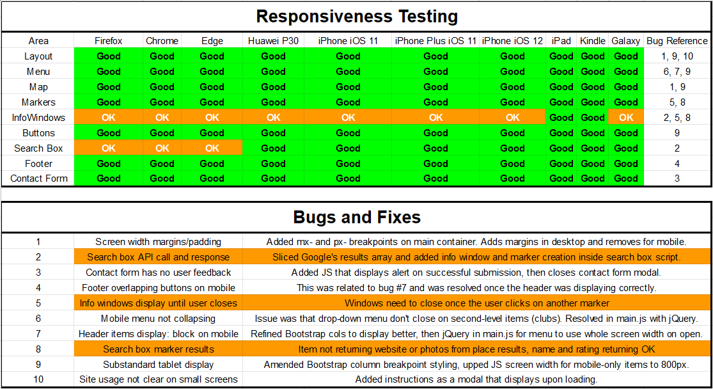
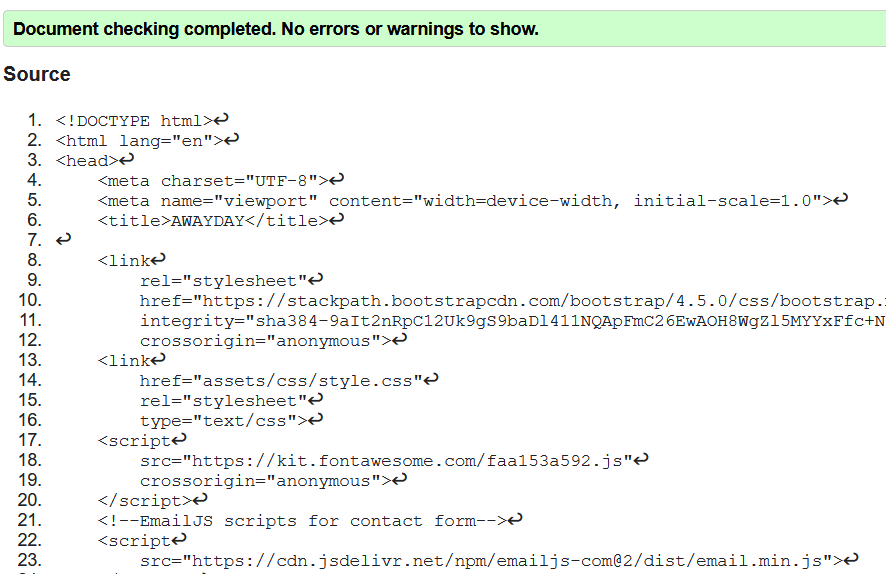
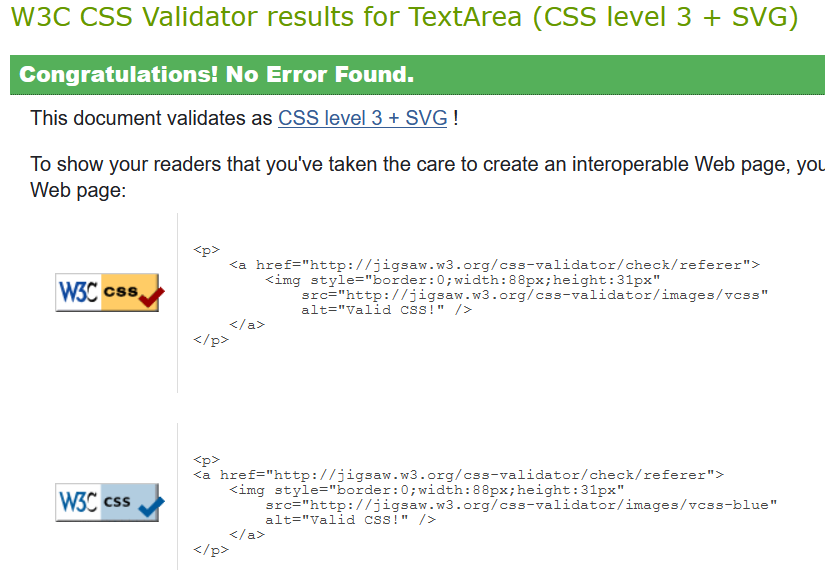
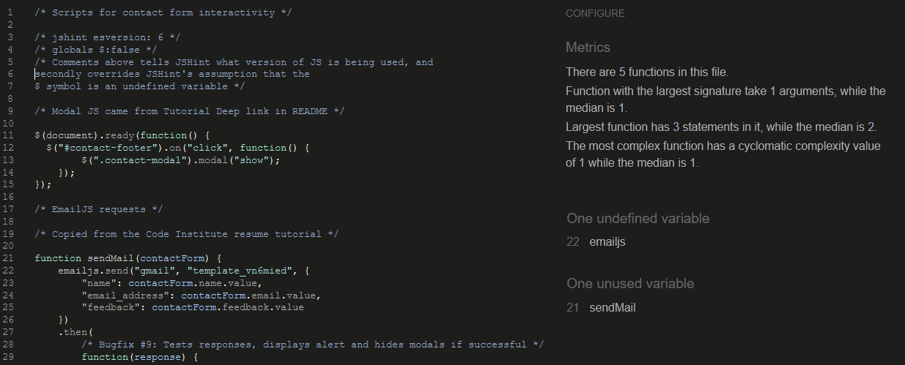
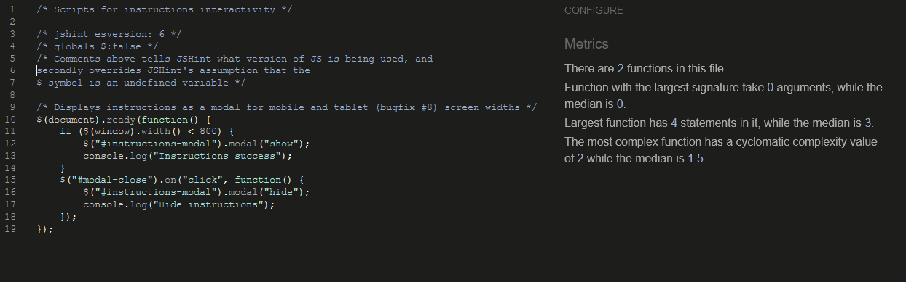
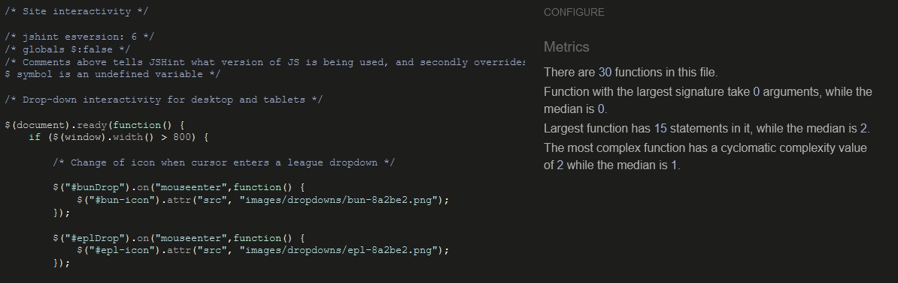

## User Stories

1. I'm travelling a long way for this match and need somewhere to stay overnight before the match;
 - The start point for any user journey on AwayDay is the drop-down menu;
 - Select your destination from the drop-down menu;
 - click the Hotel button to refine the search;
 - Click any of the markers to display more information for each location.

2. Our train arrives a couple of hours before the match, where is good for a beer?
 - Select the club you are visiting from the drop-down menu;
 - Clicking the pint glass icon will return the top-ranked pubs based on Google's Prominence score;
 - Click any of the markers to display more information for each location.

3. We've heard horror stories about the food at the ground we're visiting, can I find something decent to eat after the match?
 - Select the club you are visiting from the drop-down menu;
 - Avoid any dodgy pies by clicking the Best Food button to return the top-ranked restaurants based on Google's Prominence score;
 - Click any of the markers to display more information for each location.

4. We were at the match yesterday and visited too many of the pubs your site recommended, can you find me a good hangover coffee?
 - Select the club you are visiting from the drop-down menu;
 - Begin your detox by clicking the coffee mug icon to return the top-ranked cafes based on Google's Prominence score;
 - Click any of the markers to display more information for each location.

6. Just because I'm a football fan doesn't mean I want to drink all day, how can I search for some other things to do?
 - Good for you! Select the club you are visiting from the drop-down menu;
 - type anything you like, be it parks, museums or libraries, into the search box to return relevant results;
 - Click any of the markers to display more information for each location.

7. A local friend recommended me somewhere to go, I just need to find it on the map;
 - Select the club you are visiting from the drop-down menu;
 - The search box will also display type of or specific businesses or locations;
 - Select your specific business type or location from the predictive results to add them to the map.

8. My club or league is missing, I'd like to ask the site owner to add them to the next release!
 - Click the e-mail icon in the bottom-right corner;
 - Complete the contact form with whatever feedback you have for us;
 - We already have a list of leagues in the pipeline, but any feedback is welcome and helps us to develop a better experience, so 
 let us know and we'll bump your league up the priority list.

9. I want my business to show up on your search results for a particular club or city, who do I contact?
 - AwayDay relies on Google's algorithms and user ratings to generate results, your friendly local SEO business will be able to help 
 you soar up the rankings.

## Bugfixes

- Occasionally the call to Google's Places API would fail on account of the callback to my initMap function, and no amount of 
tinkering with Try/Catch would get any alternative images to show up in place of the #map box. I tried moving scripts around 
and removing the async property from the script tags, but luckily Kevin Loughrey at Code Institute was on hand to advise my to
load the function in the <body> tag instead of in the script call to Google. This had the dual effect of successfully displaying
my Try/Catch tests to the console, but also ensuring that the catch message never needed to be logged. 
- Bug #6: On the mobile view, when a club crest is clicked, the league-specific menu closes but the overall drop-down menu stays open. 
I tried to use class and ID selectors in jQuery to resolve this but could not find a solution. It doesn't impact the use of the site 
greatly but it does interfere with the usability flow on mobile devices, especially since people using mobiles are more likely to 
want to use the website as quickly as possible.
- Bug #7: I spent a lot of time trying to get the club crests to display in a neat way inside the drop-down menus. I piled the CSS 
rules up in an attempt to force those elements to do what I wanted, but eventually realised the power of the Element Inspector
in the browser and simply turned parameters on and off again until I found the solution that I needed. Some of the links I
have [credited](README.md) helped me realise that with CSS the rule is often 'less is more'.

## Links and Images

- When testing I have always tried to select different clubs to get as wide a selection of places returned by the API call
as possible. These are all re-centreing the map based on each club's location variable (found in the 
[map script](assets/scripts/map.js), and I have included comments on a couple of clubs where they are either ground-sharing or 
play matches at more than one stadium.
- The social media links I have included in the footer are dummy links.
- The contact form modal is live and sending any queries to an old GMail account I have.
- The links and images displayed in the infoWindow are those returned by Google, so while I have tested those extensively, I cannot 
guarantee that of the 20 results returned by the four buttons for the 135 clubs currently featured, that all of these are active and 
functioning.

## Outstanding Issues

- There is some bleed between the mobile-specific and desktop-specific jQuery scripts. Both work fine upon loading but 
once you switch between screen sizes in developer mode the hover event listener can stick in place until another icon is 
clicked. The drop-down menu will not display correctly if you switch after loading, but if you load initially as a mobile device 
it works fine. Given that most users would not sit and flick between two screen sizes while using the site, I decided to leave 
this unfixed as time was at a premium.
- If a search query returns under five results, the console will display an undefined error as the script cannot find a fifth entry 
to plot on the map. This does not affect the plotting of any other markers.
- The search box was relatively quick to install, but an unresolved issue at present is that after each search the map does not 
re-centre to the original club selection. I tried to resolve this by passing map boundaries to a variable using setBounds and getBounds
from the original club lat/long const but to no avail. As it stands, the search box will return top-ranked results biased by proximity to
the club lat/long on the first run, but then extends the map boundaries if markers fall outside of this. If another search criteria is 
then entered, it takes this boundary as a search area, rather than the club latitude and longitude. Happily this does not affect the 
four pre-set buttons that also accompany the map.

## Validation

Each page was directly inputted into the [W3C HTML Validator](https://validator.w3.org/#validate_by_input) to check that 
the markup used passed W3C standards. The CSS style sheet was directly inputted into the 
[W3C Jigsaw CSS Validator](https://jigsaw.w3.org/css-validator/#validate_by_input). The JS scripts were validated using
[JSHint](http://jshint.com/). The results can be seen below.

### Issues Raised

- The only issues that arose in the HTML validation were that I had given all of the club <li> tags a button role, and that I had 
unnecessarily specified my script types as javascript.
- The CSS script passed at the first attempt.
- For the JSHint validations, the [contact](assets/scripts/contact.js), [instructions](assets/scripts/instructions.js) and 
[main](assets/scripts/main.js) files all passed validation once I added comments specifying that I was using
 [ES6 conventions](https://www.w3schools.com/Js/js_es6.asp), and specified that the dollar symbol in jQuery syntax was not an 
[undefined variable](https://stackoverflow.com/questions/8852765/jshint-and-jquery-is-not-defined#8854093). The contact and 
[map](assets/scripts/map.js) file flagged up errors in undefined variables that were actually called within 
the [index page](index.html).

### Certificates

- HTML Validation

- CSS Validation

- JS Validation: contact.js

- JS Validation: instructions.js

- JS Validation: main.js

- JS Validation: map.js

